# Lab8Web
# Nama  : Muhammad Romdhon
# NIM   : 312010434
# Kelas : TI.20.A1

**Langkah-langkah Praktikum** 
**Persiapan** 
 Untuk memulai membuat aplikasi CRUD sederhana, yang perlu disiapkan adalah database server menggunakan MySQL. Pastikan MySQL Server sudah dapat dijalankan melalui XAMPP. 

**1. Menjalankan MySQL Server** 
 Untuk menjalankan MySQL Server dari menu XAMPP Control. 
 

**Mengakses MySQL Client menggunakan PHP MyAdmin** 
 Pastikan webserver Apache dan MySQL server sudah dijalankan. Kemudian buka melalui browser: http://localhost/phpmyadmin/ 

**2. Membuat Database: Studi Kasus Data Barang** 
**Membuat Database** 
 
**Membuat Tabel** 
 
 
**Menambahkan Data**
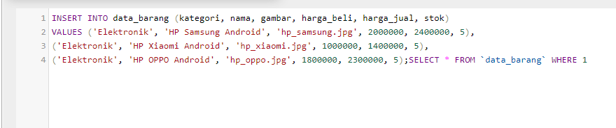 
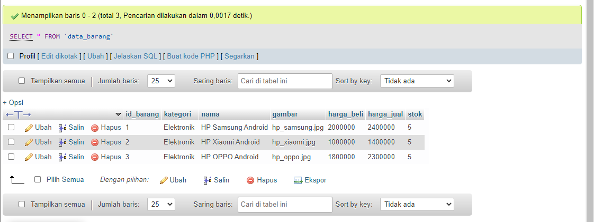 

**3. Membuat Program CRUD** 
Buat folder **lab8_php_database** pada root directory web server 
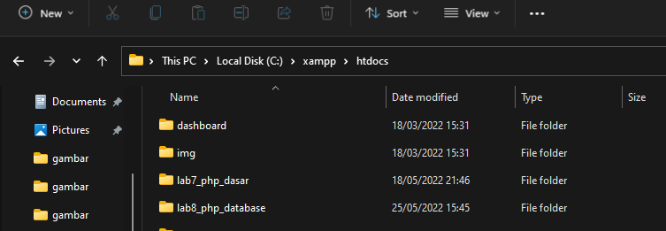 
Kemudian untuk mengakses direktory tersebut pada web server dengan mengakses URL:
http://localhost/lab8_php_database/ 
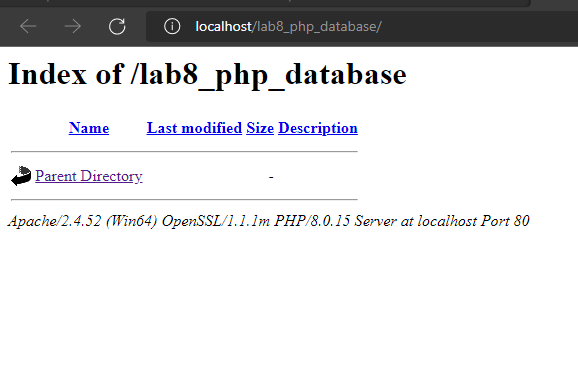 
**Membuat file koneksi database** 
Membuat file baru dengan nama **koneksi.php** 
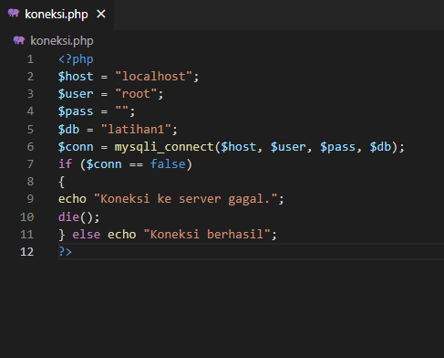 
Buka melalui browser untuk menguji koneksi database (untuk menyampilkan pesan
koneksi berhasil, ***uncomment pada*** perintah echo “koneksi berhasil”; 
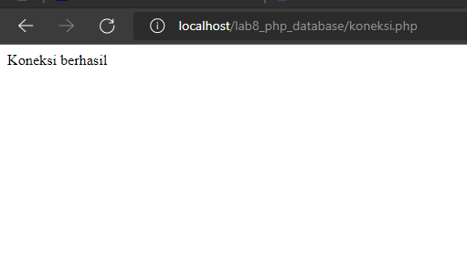 
**Membuat file index untuk menampilkan data (Read)** 
Buat file baru dengan nama **index.php** 
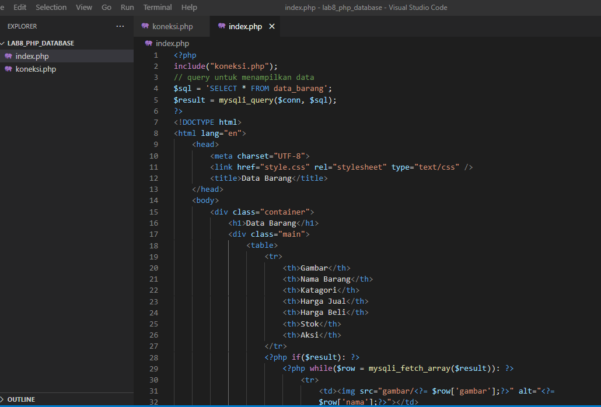 
 
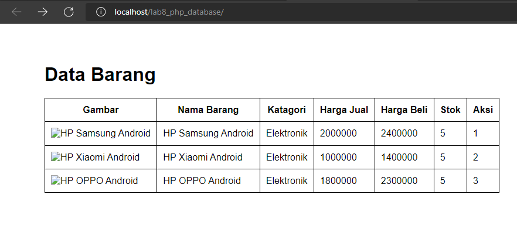 
**Menambah Data (Create)** 
Buat file baru dengan nama **tambah.php** 
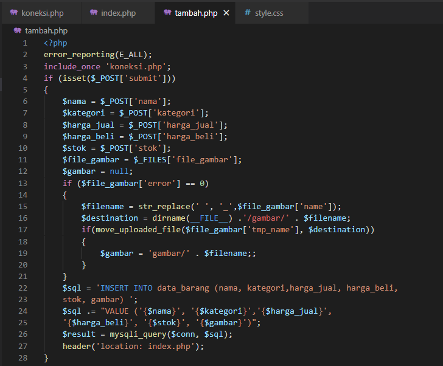 
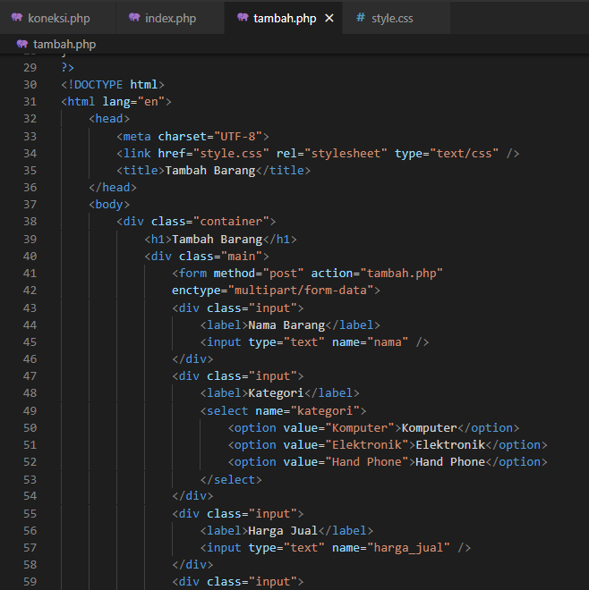 
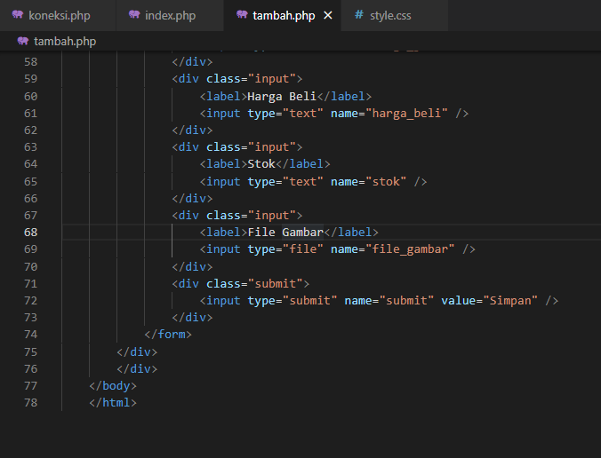 
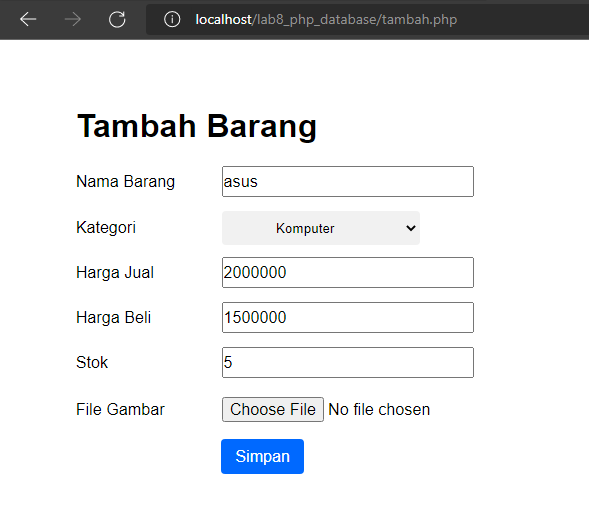 
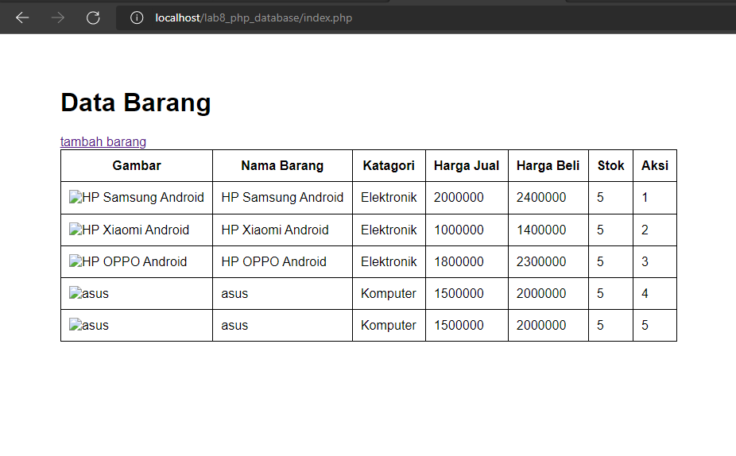 
**Mengubah Data (Update)** 
Buat file baru dengan nama **ubah.php** 
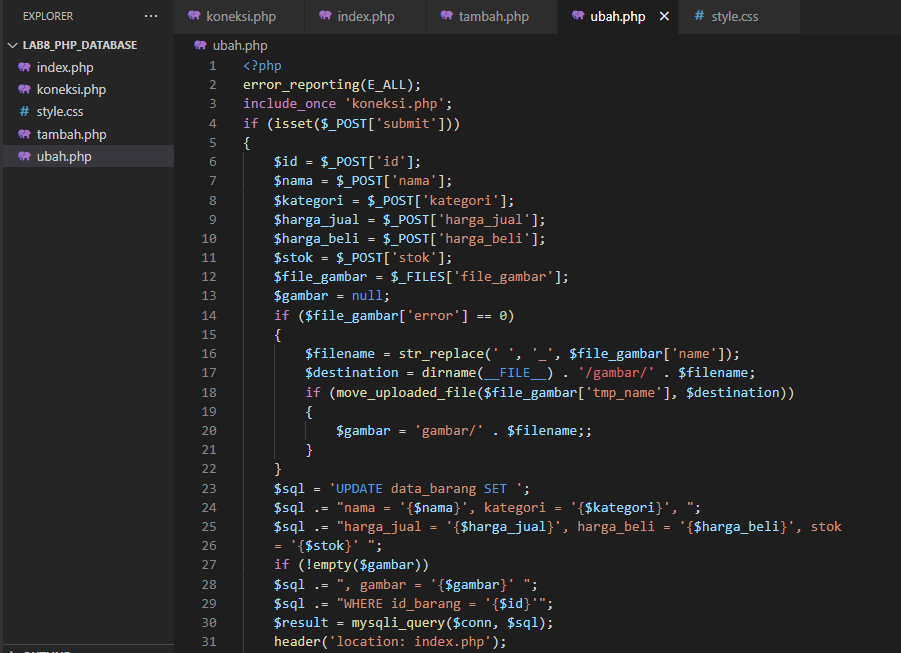 
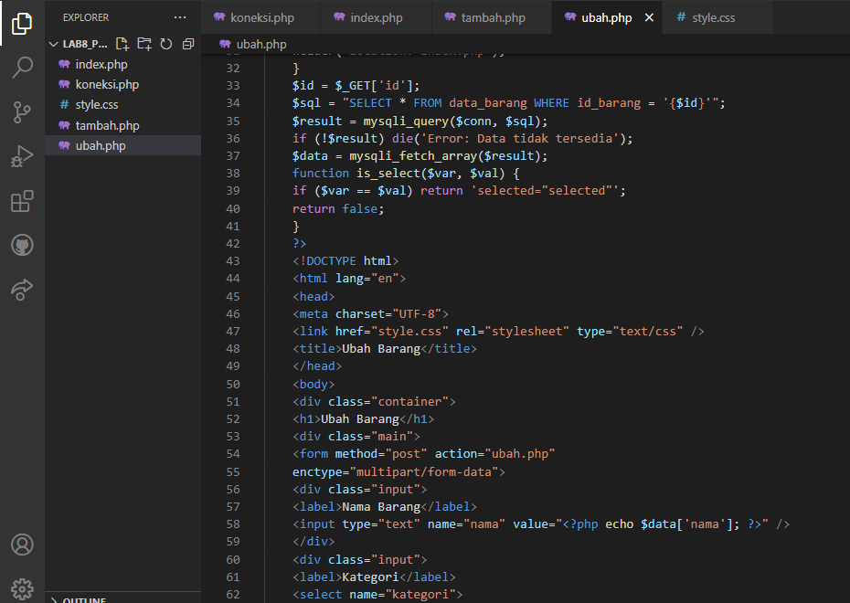 
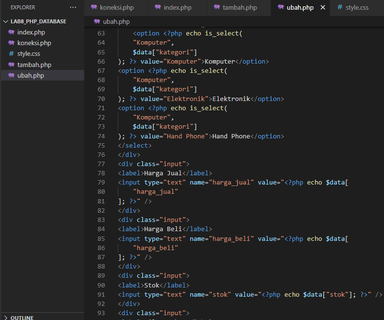 
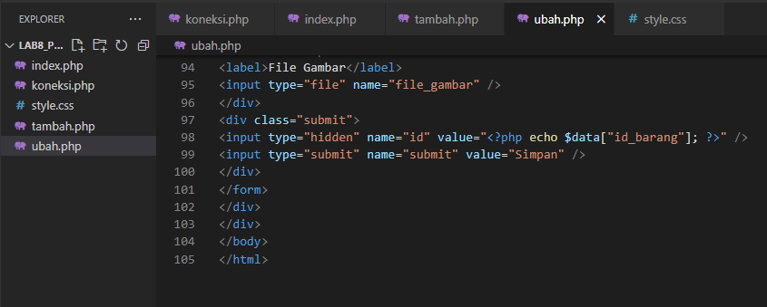 
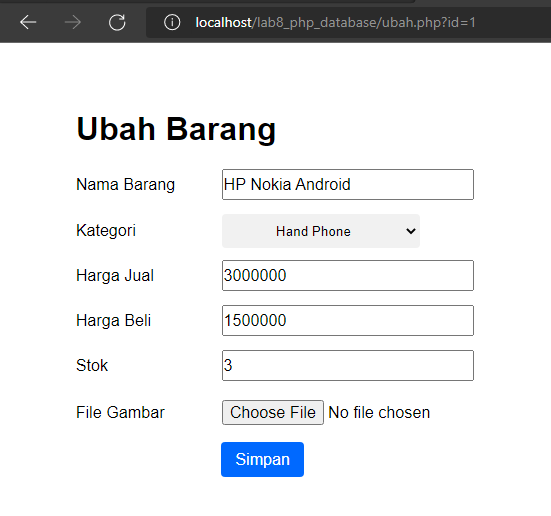 
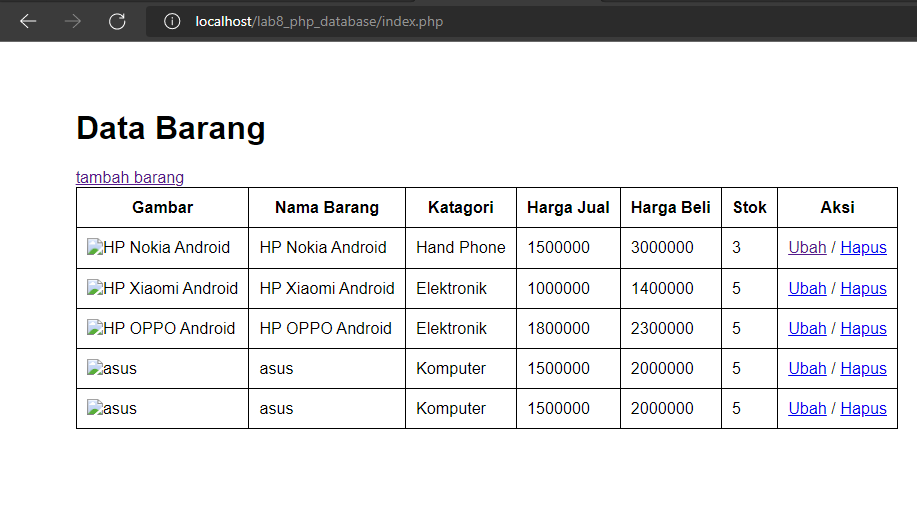 