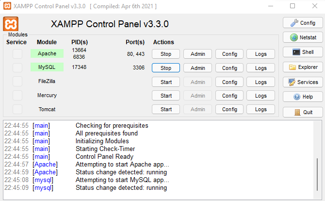
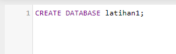
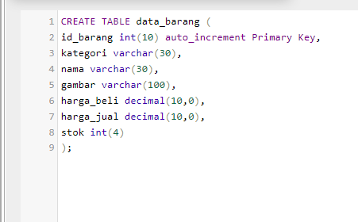
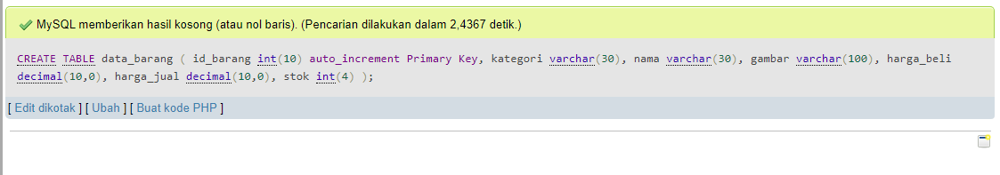

# Lab8Web
# Nama  : Muhammad Romdhon
# NIM   : 312010434
# Kelas : TI.20.A1

**Langkah-langkah Praktikum**
**Persiapan**
 Untuk memulai membuat aplikasi CRUD sederhana, yang perlu disiapkan adalah database server menggunakan MySQL. Pastikan MySQL Server sudah dapat dijalankan melalui XAMPP.

**1. Menjalankan MySQL Server**
 Untuk menjalankan MySQL Server dari menu XAMPP Control.

**Mengakses MySQL Client menggunakan PHP MyAdmin**
 Pastikan webserver Apache dan MySQL server sudah dijalankan. Kemudian buka melalui browser: http://localhost/phpmyadmin/

**2. Membuat Database: Studi Kasus Data Barang**
**Membuat Database** 

**Membuat Tabel**

